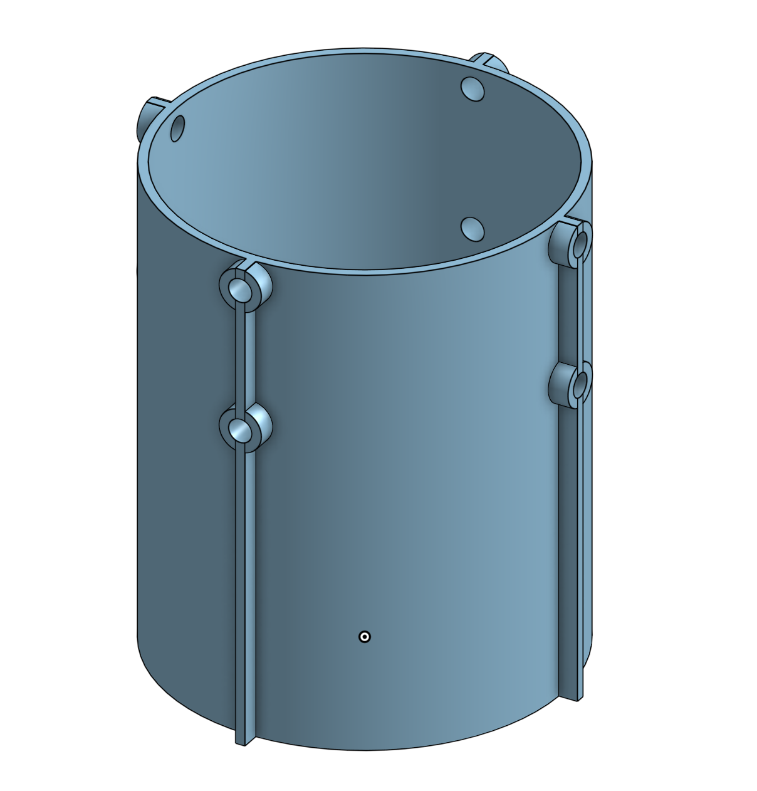
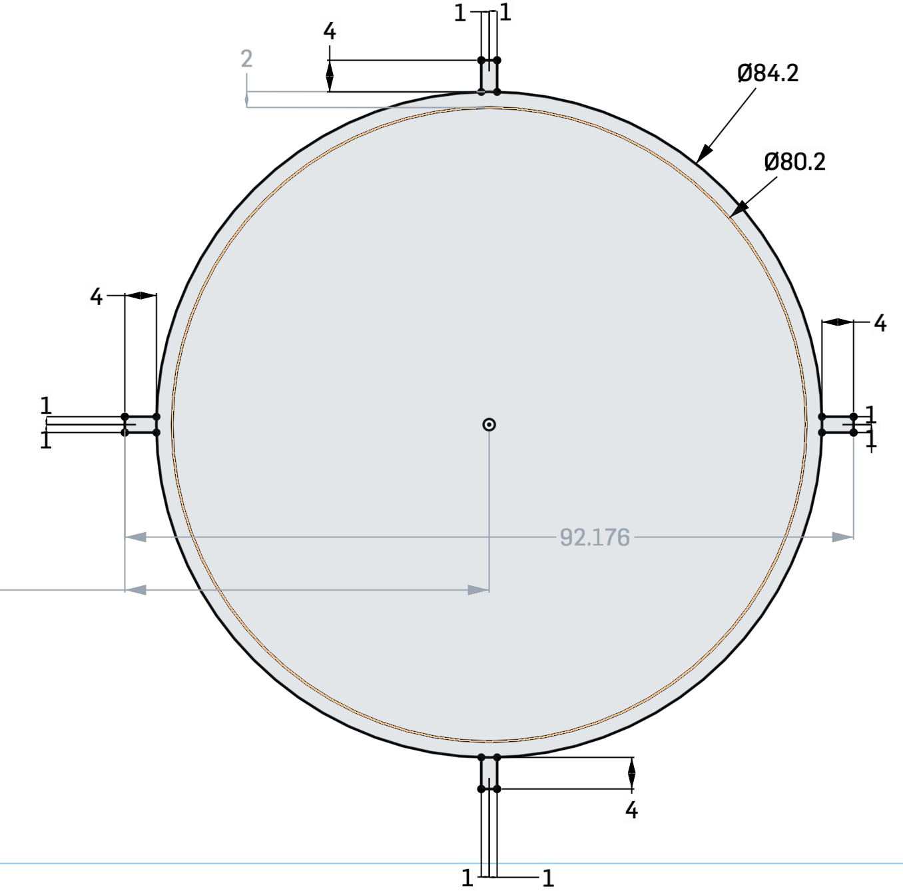
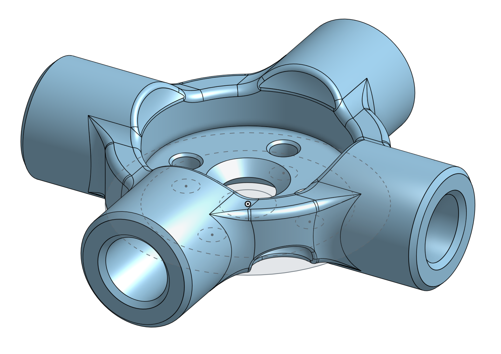
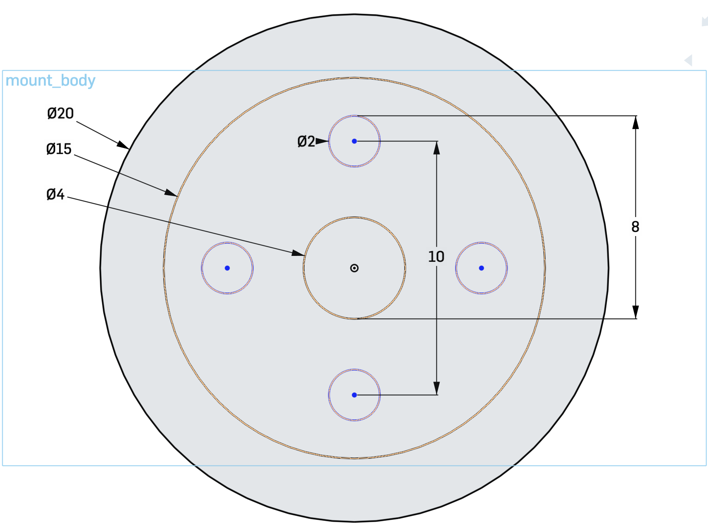
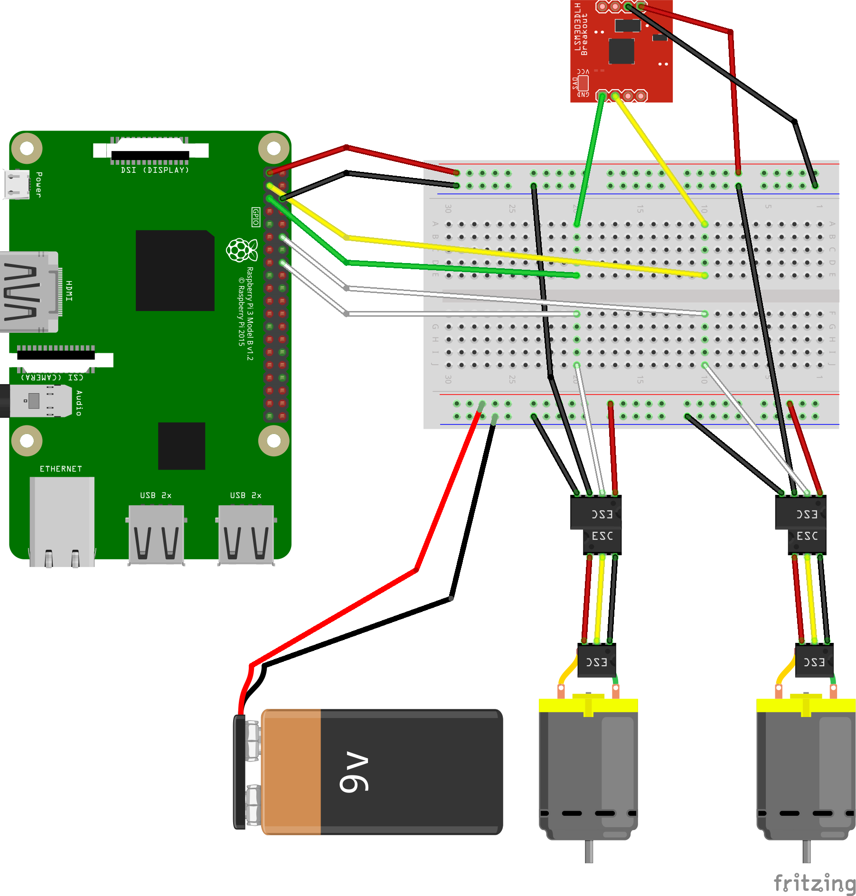

# Cube Interface
A website to be hosted on a raspberry pi ( **raspi** ) for ease of access when prototyping brushless motors and orientation sensors.

## About
I created this project to prototype a web interface to interact with hardware like motors and sensors. The hardware required, 3D printed objects, and wiring is not designed for a final flying product, but is only to get started. The main goal of this project is to start on a good foot when building an end product. 

## Goals
- GUI must be easy to use and read
- Must be able to move along the *z-axis*
  - Able to go **up and down**
  - Able to **hover**
- Must have control over rotation along the *z-axis*
  - Able to hold a **bearing** *(0° - 360°)*

## Steps
- Build a **web server** on a raspberry pi (raspi)
- Build a client side **frontend**
- Turn brushless motors **on & off**
- Adjust the **speed** of **each** brushless motors
- Adjust the **speed** of **both** brushless motors (coupled)
- Be able to **tune** both motors (one faster than the other)
- **Read** data off of sensors (Magnetometer, Gyroscope, Accelerometer)
- **Convert** read sensor data into raw values
- **Mutate** converted data into usable data
- **Send data** from *raspi server* to the *frontend*
- **Display** received data
- **Graph** received data
- **Zero** sensors

## Hardware Required
Links correspond to what I personally used. However, feel free to mix and match  for what you are looking for. 
- x1 [Raspberry Pi](https://www.adafruit.com/category/105) (Preferably one with Wifi)
- x2 [Brushless Motors](https://hobbyking.com/en_us/multistar-v-spec-1104-3600kv-multi-rotor-motor-ccw.html)
- x2 [ESCs](https://hobbyking.com/en_us/blheli-s-30a.html)
- x2 [Propellers](https://hobbyking.com/en_us/racekraft-3041-q4cs-clear-4pcs-set.html) 1 CW, 1 CCW
- x1 [9 DOF Orientation Sensor](https://www.adafruit.com/product/2020) (LSM9DS0)
- x1 [Battery](https://hobbyking.com/en_us/batteries-chargers.html) for ESCs (I used a 4 cell battery ~14.8 Volts)
- [5mm OD Aluminium Tubing](https://eugenetoyandhobby.com/shop/k-s-9804-round-aluminum-tube-5mm-od-x-45mm-wall-3/?gclid=CjwKCAjw4MP5BRBtEiwASfwAL_PvMPWYh1XuFTzg9hOkHAozzurpU4z9uvWdKBa1yrM101omjyYUCBoC0V0QAvD_BwE)
- Bolts for motor
- [Jumper wires](https://www.adafruit.com/?q=jumper%20wires)
- Personal Computer
- WiFi network (mobile hotspot works as well)
- Access to a 3D Printer

###### ***NOTE:** Quality 3D printers are expensive so personally I used a craigslist service to have my objects printed and shipped.*

## CAD Models
#### [Onshape™ Models](https://cad.onshape.com/documents/c5a66f21c28828a756cf88b1/w/3172519d3cd5b9c9eeba6fb3/e/0769fcc171bb256ae3bfbe8a)
#### Body


#### Motor Mount



## Wiring
#### ***NOTE:** I am not good with fritzing™ software, use notes as well.*
- red chip --> LSM9DS0
- 9v Battery --> 14.8v LiPo Batter



###### ***NOTE:** This is a general representation, soldering may be required to connect wires to sensor, esc, motor, and battery.*

###### ***NOTE:** Breadboard can be disregarded and connections can be made directly between entities*
y

## Installation - Raspi Terminal
```bash
$ git clone https://github.com/robertIanClarkson/Cube-Interface.git
$ cd Cube-Interface
$ sudo npm install
```

## Running
#### Raspi Terminal (in 'Cube-Interface' directory)
##### Need ip address of raspi 
```bash
$ hostname -I
10.0.0.105
```
##### Start server
```bash
$ make go
```

#### On Personal Computer
##### enter ip address followed by :3000 into web browser(Chrome or Firefox)
```bash
10.0.0.105:3000
```

## Usage

## Journal
##### *This Project was started in 2017. I was very new to programming but was able to get the motors running via a terminal menu. I could not produce enough thrust out of the brushless motors and stopped working on the project. In May of 2020, upon Covid-19 I had a surplus of time and a much better understanding of programming and decided to pick the project back up. Ironically using the same parts as in 2017, I was able to create enough thrust by simply putting my 2 7.4v batteries in series, doubling the voltage. However, the motors and propellers I was using where incredibly violent and loud leading me to make a smaller model. This allowed me to prototype at my desk without be too loud (was still pretty loud). After many hours of working on this project it was really starting to come together and I decided to keep this journal as well as pictures and videos.*

```
8/11/2020
Worked on both motor speed sliders and the coupled slider be responsive to each other
Made my first draft of the README
```

## Contributing
Pull requests are welcome. For major changes, please open an issue first to discuss what you would like to change.

Please make sure to update tests as appropriate.

## License
[MIT](https://choosealicense.com/licenses/mit/)